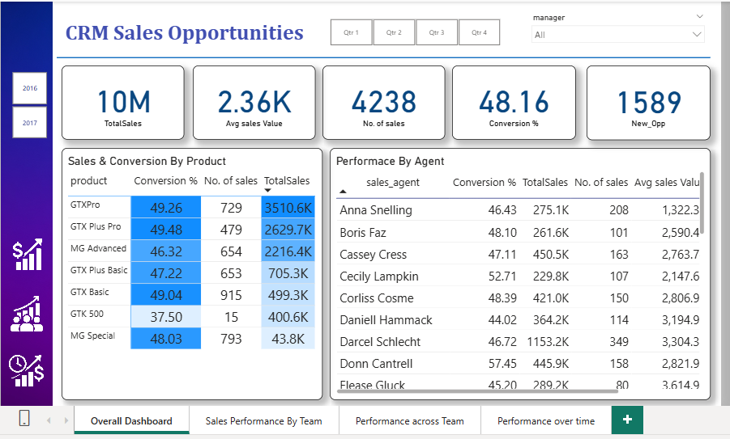

# CRM-Sales-Opportunities
This Power BI project visualizes key sales and opportunity metrics from a CRM system to analyze how each sales team performs under different managers and products.

 # 🎯 Project Goal
The goal of this dashboard is to track and compare team performance under each manager, helping identify top-performing agents, products, and conversion trends across time periods.

## DashBoard

# 🔍 Overview

The dashboard provides a detailed view of:

Total Sales: 10M+ overall revenue

Average Sales Value, Conversion Rate, and New Opportunities

Sales & Conversion by Product — identifies top-performing products

Performance by Sales Agent — tracks total sales, number of deals, and conversion efficiency

💡 Key Insights

Compare sales performance across agents and products

Identify trends in conversion rates and new opportunities

Evaluate sales growth by quarter or manager filters

🛠️ Tools Used

Power BI for data visualization

CRM Sales Dataset for opportunity tracking and performance analysis

📁 Pages Included

Overall Dashboard – Summary of key sales KPIs

Sales Performance by Team

Performance Across Team

Performance Over Time
